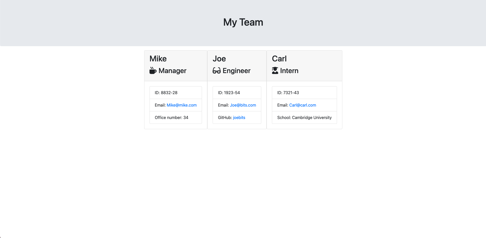

# <h1 align="center">**✨ Online Cohort Builder ✨**</h1>

## 📝 **Description**
This application is a CLI-based online cohort generator. The generator supposedly is purposed to create a roster much more conveniently saving time and effort. This project practices heavily on Test-Driven Development (TDD) and advanced ES6 / Node.js functions.

## **Demo**

## 🗂️ **Table of Contents**
1. [Installation](#installation)
2. [Usage](#usage)
3. [License](#license)
4. [Questions](#questions)

## 💻 **Installation** 
Initialise node by running in your terminal of choice `npm init -y`. Install `Node.js` and `npm`, to your local machine by running `node install -y`, to fully experience this application. Using `npm`, install the `inquirer` package by entering into the terminal: `npm i inquirer@ 6.3.1`.

Tests can be done by firstly installing jest on your local machine by `npm install jest`.

## 🚀 **Usage** 
First, `fork` the repository into your personal GitHub workspace and `clone` the project — this is so that you have your own personal copy of the application. Open the application to explore the project files if you wish. To start the application, open a `terminal` and locate to the `root` directory. Then, type `node index js`. A series of prompts will appear instantly to allow you to enter data in. Upon success, a html file named `team.html` will be created, and updated with every iteration.

Navigate to the file under the `output` directory and open the newly generated html file via `Open with Live Server` to view the application.

## 🪪 **License** 
 — (<Project-Title> is covered under MIT License.)

## ❔ **Questions** 
Any queries about this project, please feel welcome to reach out to me using the following credentials:
<h3>Josh Capito</h3>
- Github: <a href="https://github.com/jemcap">Josh Capito</a>
 
- Email: <a href="mailto:joshuaecapito22@gmail.com">joshuaecapito22@gmail.com</a>